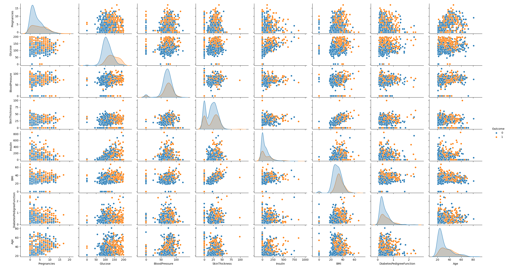

# Diabetes Prediction using Machine Learning

A machine learning system for early diabetes detection using clinical biomarkers and ensemble methods.

## Dataset Overview

The project uses a diabetes dataset containing clinical features from patients. The dataset includes key health indicators for diabetes prediction.

### Features Description
- **Pregnancies**: Number of times pregnant
- **Glucose**: Plasma glucose concentration
- **BloodPressure**: Diastolic blood pressure (mm Hg)
- **SkinThickness**: Triceps skin fold thickness (mm)
- **Insulin**: 2-Hour serum insulin (mu U/ml)
- **BMI**: Body mass index (weight in kg/(height in m)^2)
- **DiabetesPedigreeFunction**: Diabetes pedigree function
- **Age**: Age in years
- **Outcome**: Target variable (1 = diabetic, 0 = non-diabetic)

### Engineered Features
- **BMI_Age**: BMI to Age ratio
- **Glucose_Insulin**: Glucose and Insulin interaction term

## Pair plot

## Features

- **Data Preprocessing**: Robust scaling and missing value handling
- **Feature Engineering**: Creation of meaningful composite features
- **Advanced Feature Selection**: RFECV for optimal feature subset
- **Multiple ML Models**: Comparison of 6 different classifiers
- **Hyperparameter Tuning**: GridSearchCV for model optimization
- **Cross-Validation**: Stratified 5-fold cross-validation

## Model Performance

| Metric | Score |
|--------|-------|
| **Accuracy** | 82.5% |
| **F1-Score** | 73% |
| **ROC AUC** | 79% |
| **Recall** | 66.7% |

## Discussion on this project

This was my first ML project, there are lot of things to improve and many features to add like stacking method, xgboost optimization and many others to increase my score !
